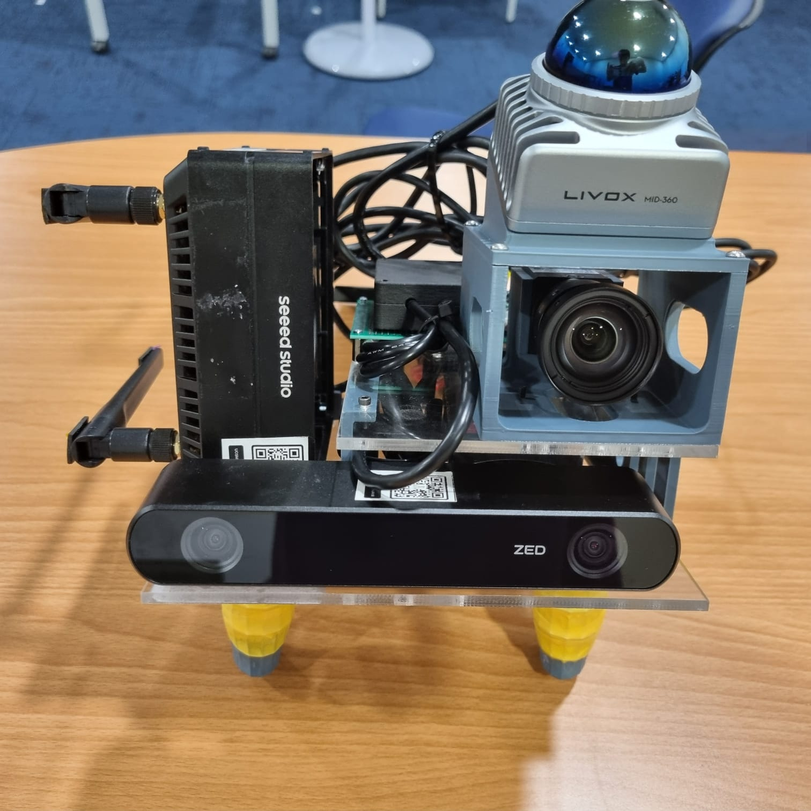
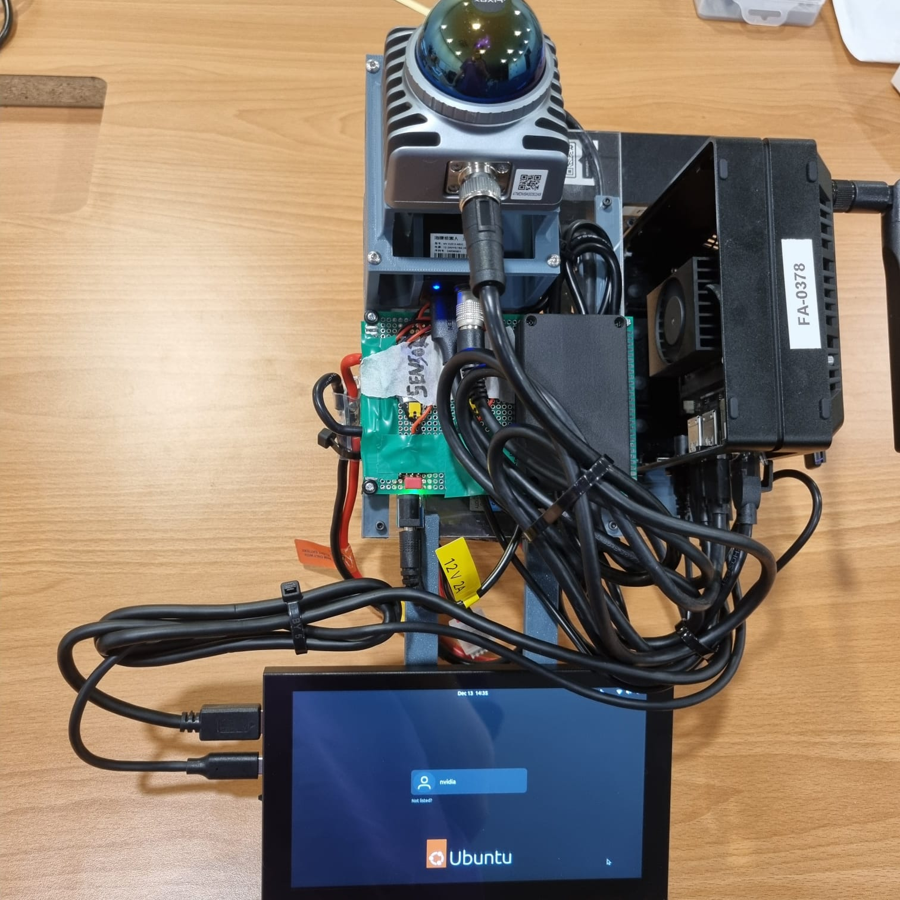
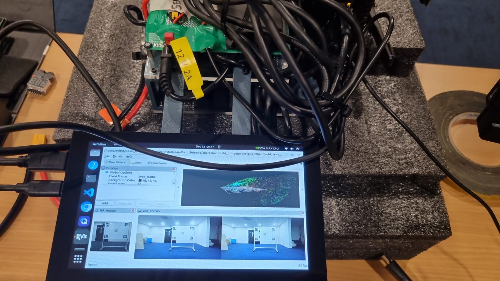
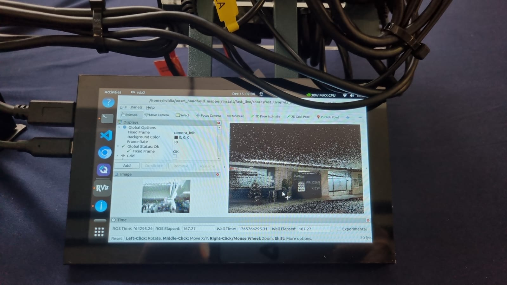
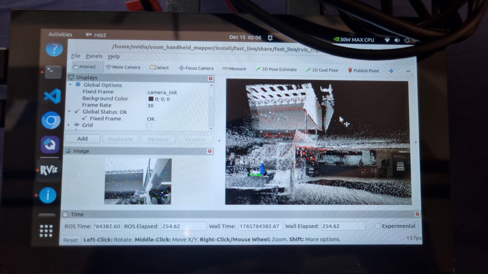
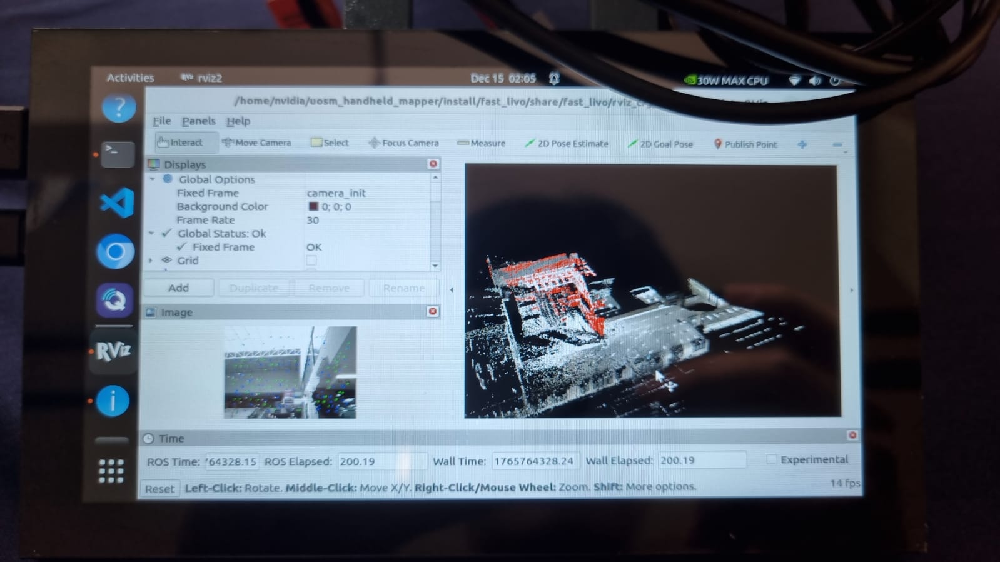

# UoSM Handheld Mapper

Custom Rig for https://github.com/hku-mars/LIV_handhold_2, support ROS2 Humble. 

FAST-LIVO2 is based on [https://github.com/yqmy0814/FAST-LIVO2] and [https://github.com/hku-mars/FAST-LIVO2/issues/128]

**Note:-**

1. **livox_ros_driver2** is custom, not the official version from Livox. It reads and writes from a time-share file located in `home/${User}/timeshare` for synchronization. Ensure to set a static IP of `192.168.1.50` for the device connected to the Livox LiDAR. 
2. The **FAST-LIVO2 voxelmap** is unbounded, which means memory usage will grow indefinitely. This could potentially lead to issues such as a forced shutdown when mapping for extended periods on systems with limited memory, like the Jetson Orin (16GB RAM). 
   - Relevant issues: [#386](https://github.com/hku-mars/FAST-LIVO2/issues/386), [#224](https://github.com/hku-mars/FAST-LIVO2/issues/224), [#258](https://github.com/hku-mars/FAST-LIVO2/issues/258), [#289](https://github.com/hku-mars/FAST-LIVO2/issues/289)
   - Build configuration issues: [#68](https://github.com/hku-mars/FAST-LIVO2/issues/68), [#101](https://github.com/hku-mars/FAST-LIVO2/issues/101), [#146](https://github.com/hku-mars/FAST-LIVO2/issues/146)
   
3. **libusb** from MVS (`/opt/MVS/lib/aarch64/libusb-1.0.so.0`) may conflict with the system installation (`/lib/aarch64-linux-gnu/libusb-1.0.so.0`). It is recommended to either delete the MVS version or set the system's `libusb` with the following commands:
```
export LD_LIBRARY_PATH=/opt/MVS/lib/aarch64:$LD_LIBRARY_PATH
export LD_LIBRARY_PATH=/usr/lib/aarch64-linux-gnu:$LD_LIBRARY_PATH
```
4. This repo uses cyclondds and mcap storage. Get it with:
```
sudo apt install ros-humble-rmw-cyclonedds-cpp ros-humble-rosbag2-storage-mcap
```

## Hardware / Environment
- Nvidia Jetson Orin NX 16GB
- Jetpack 6.2
- Ubuntu 22.04
- [ROS2 Humble](https://docs.ros.org/en/humble/Installation/Ubuntu-Install-Debs.html)
- [ZED SDK 5.1](https://download.stereolabs.com/zedsdk/5.1/l4t36.4/jetsons?_gl=1*fphl2z*_gcl_au*MTY3ODk4NTkwMy4xNzY1OTExMTAz) 
- [MVS 3.0.1 ARM](https://www.hikrobotics.com/en/machinevision/service/download/)
- [Livox-SDK2 v1.2.5](https://github.com/Livox-SDK/Livox-SDK2/blob/master/README.md)
- OpenCV v4.8.0
- PCL  v1.12.1
- Eigen v3.4.0




## Build 

### Get submodules and dependencies
```
git submodule init
git submodule update
sudo apt update
rosdep update
rosdep install --from-paths src/zed-ros2-wrapper --ignore-src -r -y # install dependencies
rosdep install --from-paths src/livox_ros_driver2 --ignore-src -r -y
rosdep install --from-paths src/mvs_ros_driver2 --ignore-src -r -y
rosdep install --from-paths src/FAST-LIVO2 --ignore-src -r -y
rosdep install --from-paths src/ros2_jetson_stats --ignore-src --rosdistro humble -y
```

### Erase all and rebuild
```
./src/livox_ros_driver2/build.sh humble
```

### Build only specific packages
```
colcon build --packages-select handheld_bringup --symlink-install # eg handheld_bringup
```

## Run Calibration Recording
```
source ./install/setup.bash
ros2 launch handheld_bringup handheld_sensors.launch.py
```


## Run Fast-Livo2
**Note :-**

Comment out driver nodes and set preprocess.lidar_type to `3` for bags using standard pointcloud2 msg rather than livox custom msg.
```
source ./install/setup.bash
ros2 launch handheld_bringup fast_livo2.launch.py

# ros2 bag play ./data/record_20251214_173541/ -p --remap /hik_camera/image:=/left_camera/image

# source ./install/setup.bash
# ros2 launch fast_livo mapping_avia.launch.py
# ros2 bag play ./data/fast_livo/test_bag/ros2/ -p
```





## Replay from ZED SVO and re-record to ros2 bag
```
source ./install/setup.bash
ros2 launch handheld_bringup zed_svo_replay.launch.py \
    svo_file_path:=/home/ubuntu/Desktop/dataset/uosm_library/svo_20251225_143259/zed_recording.svo2 \
    bag_output_path:=/home/ubuntu/Desktop/dataset/uosm_library/zed_ros_output
```